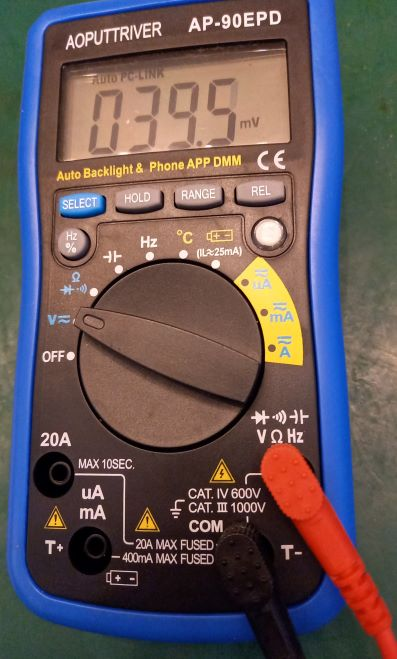

# Connect to Bluetooth Multimeter

Get BLE Multimeter data to PC. With approx 2 samples per second (in DC Volt mode).

Works for

* AOPUTTRIVER AP-90EPD

Should also work for, maybe with different "CHARACTERISTIC_UUID"
* HoldPeak HP-90EPD

Multimeters via BLE (Bluetooth Low Energy) connection *without* prior pairing of the devices.

Tested with Windows 10, Linux.

## Credits

This work derives heavily from two main sources:

* https://alexkaltsas.wordpress.com/2013/04/19/python-script-to-read-data-from-va18b-multimeter/
* https://www.element14.com/community/community/element14-presents/workbenchwednesdays/blog/2020/03/09/connecting-to-mp730026-ble-dmm-with-python-and-bleak

# Quickstart

Install dependencies via `pip install -r requirements.txt`.

Switch on your multimeter in close proximity (~5m) to the PC.

Enter your multimeter's BLE MAC Address in main.py: `address = ('...')`. Use bleak_scan.py to find the MAC address.

Run `main.py`.

Watch terminal.
